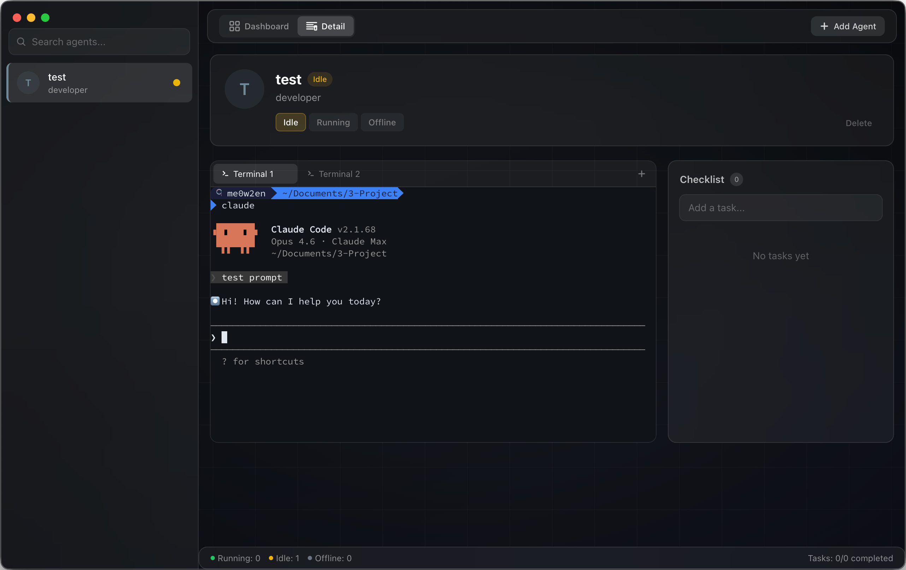

# TermDeck

**멀티 터미널 세션 관리 대시보드**

[](LICENSE)
[](https://www.electronjs.org/)
[](https://react.dev/)

여러 터미널을 띄워놓고 동시에 프로젝트를 돌리다 보면, 어느 창에서 뭘 하고 있었는지 헷갈리고, 각 작업이 어디까지 진행됐는지 한눈에 파악하기가 어려웠습니다. 다양한 에이전트 관리 서비스들을 써보면서 좋은 점들을 참고하되, 개인적으로 필요한 핵심 기능만 가볍게 담아 만든 프로젝트입니다.

TermDeck은 에이전트별 독립 터미널, 체크리스트, Claude Code 모니터링을 하나의 대시보드에서 제공합니다.



## Features

- **멀티 터미널 세션 관리** — 여러 에이전트를 생성하고 터미널 세션 간 즉시 전환
- **내장 터미널** — 에이전트별 독립 터미널 에뮬레이터 (xterm.js + node-pty)
- **Claude Code 모니터링** — Claude Code 세션 활동을 실시간 추적
- **에이전트별 체크리스트** — 에이전트마다 할 일 목록 관리, localStorage에 자동 저장
- **대시보드 오버뷰** — 전체 에이전트 상태와 체크리스트 진행률을 그리드 뷰로 확인

## Installation

### Prerequisites

- [Node.js](https://nodejs.org/) >= 18
- npm 또는 yarn
- macOS / Windows / Linux

### Setup

```bash
# Clone the repository
git clone https://github.com/me0w2en/TermDeck.git
cd TermDeck

# Install dependencies (node-pty가 Electron용으로 자동 빌드됩니다)
npm install

# Start development mode
npm run dev
```

### Build

```bash
# Build for production
npm run build

# 터미널이 동작하지 않는 경우 네이티브 모듈 수동 재빌드
npm run rebuild
```

## Project Structure

```
src/
  app/App.tsx                              메인 레이아웃
  components/
    agents/                                AgentListItem, AgentDetailPanel,
                                           Checklist, AddAgentModal, InitialAvatar
    dashboard/DashboardView.tsx            대시보드 그리드 뷰
    terminal/                              TerminalPanel, TerminalContainer
    layout/                                Sidebar, TopBar, StatusBar, Background
    common/ConfirmDialog.tsx               공통 UI 컴포넌트
  hooks/
    useAgents.ts                           에이전트 CRUD + 체크리스트 + 영속성
    useClaudeMonitor.ts                    Claude Code 세션 모니터링
  utils/format.ts                          유틸리티 함수
  types/                                   TypeScript 인터페이스 + Electron API 선언
  styles/globals.css                       전역 스타일
electron/
  main.js                                  BrowserWindow + 터미널 IPC (node-pty)
  preload.js                               contextBridge 터미널 API
```

## Tech Stack

| 분류 | 기술 |
|------|------|
| 프레임워크 | Electron 33 |
| 프론트엔드 | React 18 · TypeScript 5 |
| 빌드 도구 | Vite 6 |
| 스타일링 | Tailwind CSS 3 · Framer Motion 11 |
| 터미널 | xterm.js 5 · node-pty |

## License

이 프로젝트는 MIT 라이선스를 따릅니다. 자세한 내용은 [LICENSE](LICENSE) 파일을 참고하세요.
